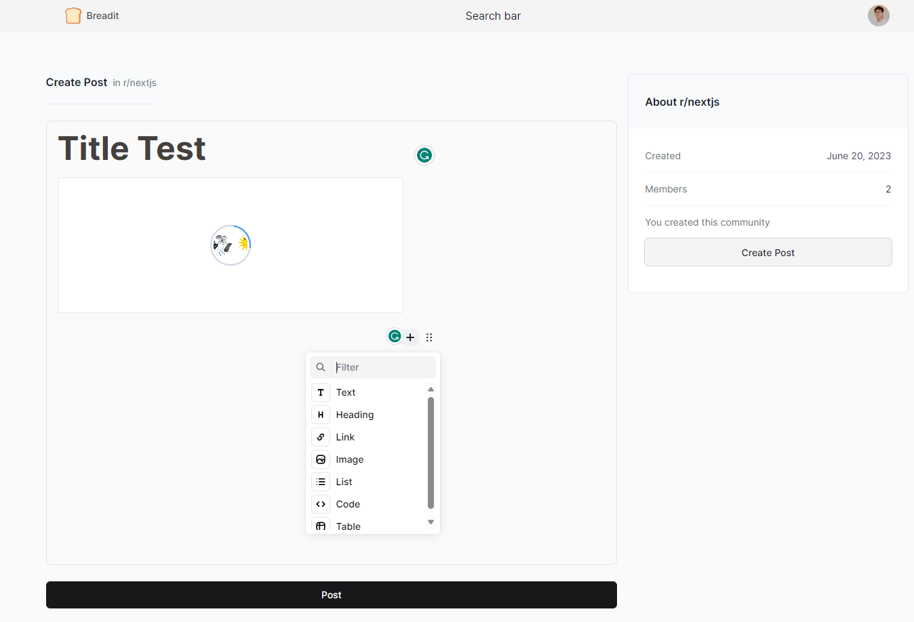

# BREADIT

Fullstack Reddit Clone
<hr/>

## Tech-stack
- NextJS 13
- TypeScript
- TailwindCSS, shadcn/ui
- Next-Auth
- Prisma
- Redis (Upstash)
- MySQL / PlanetScale
- React-Query
- React-Hook-Form
- EditorJS
- date-fns
- Vercel

## Setup

1. Connect to DB MySQL/PlanetScale
- Install `planetscale-cli`
  - https://github.com/planetscale/cli#windows
- Create an account and & db in [planetscale](planetscale.com)
- Get Connection with Prisma type and update `DATABASE_URL` to `.env`
- Run these cmd
```
pscale auth login
yarn prisma generate
yarn prisma db push
```

2. Create Google ID & Google Client ID
- create new project in [Google Cloud](cloud.google.com)
- setup new credentials in OAuth2
- update `GOOGLE_CLIENT_ID` & `GOOGLE_CLIENT_SECRET` in `.env`

3. Create Upstash/redis ID
-  create new project in [Upstash](upstash.com) with Redis database 
-  get 2 key in REST API (`UPSTASH_REDIS_REST_URL`, `UPSTASH_REDIS_REST_TOKEN`) of console.upstash.com
-  update key in `.env`
```
REDIS_URL={UPSTASH_REDIS_REST_URL}
REDIS_SECRET={UPSTASH_REDIS_REST_TOKEN}
```

4. `NEXTAUTH_SECRET`
- access to https://generate-secret.vercel.app/32 to get the key

5. Install dependencies
```
yarn
```

6. Run project
```
yarn dev
```


# Preview


<br/>


<br/>


<br/>

